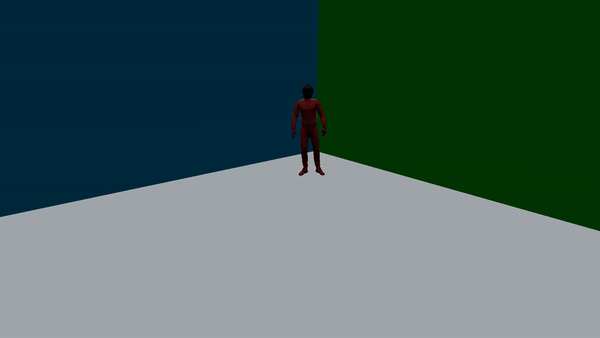
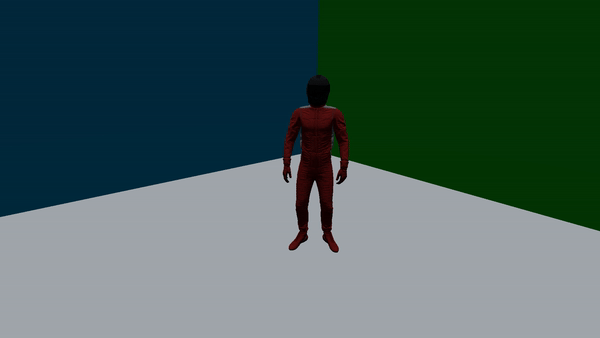

# Fast Godot Multiplayer 3D FPS
Repo to fork if you want a quick and easy way to start a (local) multiplayer FPS with movements and animations of the player.

## What do you have in this repo ?
- Basic Networking ( each player will see the things described under )
- FPS player with :
    - Movements ( + jump & sprint )
    - Animations ( jumping, running, walking, idling, punching, paring )
    - Emotes ( backflip + a bunch of dances )
- Basic menu ( host, join, ip )

## How does it work ?
When you want to test on your computer you just have to launch 2 windows of the game and simply click on Host and Join. If you are on the same wifi with a friend or you use hamachi to create a fake local network, the person who click on join will have to write the ip adresse of the host.

## How does it look ?

( Low fps only on the gif ofc )

## Keybinds
- Z,Q,S,D for movements ( if you want WASD you can change it by going into Project -> Parameters -> Controls -> and you edits with your settings )
- Space and Shift for jumping and sprinting
- 1,2,3,4 and V for the emotes
- F11 for FullScreen
- Escape to escape ( OMG )

## Credits
- Mixamo for the animations ( https://www.mixamo.com/#/ )
- Video Youtube of Garbaj ( https://www.youtube.com/watch?v=K0luHLZxjBA&t=5s&pp=ugMICgJmchABGAE%3D )
- TRAPMANIA ( Multi Deathrun game GarrysMode like where i did all of this ) ( if you want to play it DM me on twitter at @CortinovisEnzo i will send you a link )
